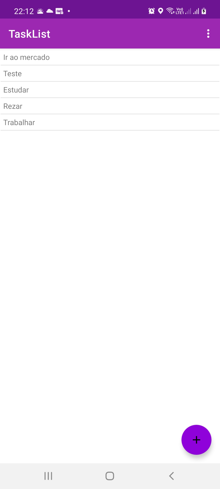
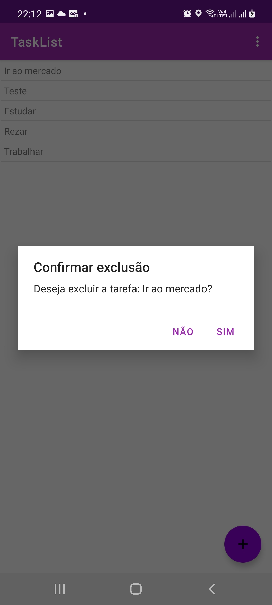
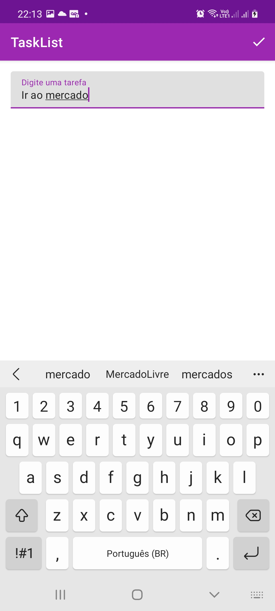

## An Android App Example how to CRUD in Data Base use Data Access Object (DAO) pattern

* Data Access Object (DAO) pattern
* Android SQLiteOpenHelper
* Android RecyclerView

   

### Reference
* https://developer.android.com/reference/android/database/sqlite/SQLiteOpenHelper
* https://en.wikipedia.org/wiki/Data_access_object
* https://developer.android.com/guide/topics/ui/layout/recyclerview?gclid=CjwKCAjw47eFBhA9EiwAy8kzNIFwxkrpD4mitZES7EroB_67Y01inYYkAY3CrgvV5QuLyqqLWcow5xoCCdsQAvD_BwE&gclsrc=aw.ds